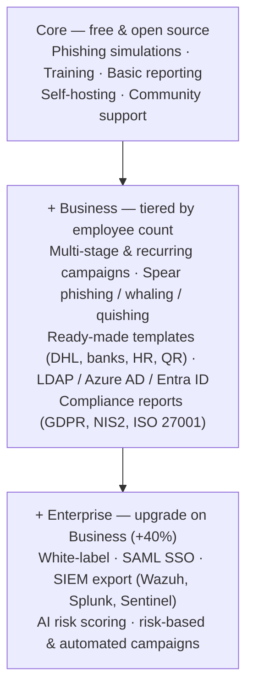

# SentryMail.

**Security awareness that actually works — and stays with you.**

Realistic phishing simulations, training that sticks, and reporting that makes progress visible. The only solution in its category that can be fully **self-hosted**.

[View pricing](https://sentrymail.de/en/preise/) · [View on GitHub](https://github.com/securebits-cyber/sentrymail.de)

---

## The differentiator: self-hosting

> **SentryMail is the only solution in its category that can be run fully self-hosted.**

The established security-awareness vendors operate exclusively as cloud SaaS:

| Vendor | Deployment |
|---|---|
| KnowBe4 | Cloud-only (hosted on AWS) |
| SoSafe | Cloud-only |
| Hoxhunt | Cloud-only |
| Proofpoint | Cloud-only |
| **SentryMail** | **Self-hosted, managed service, or cloud** |

That makes SentryMail relevant for organizations where cloud SaaS is off the table — or only conditionally viable — for regulatory or contractual reasons: KRITIS operators, public-sector bodies bound by BSI IT-Grundschutz, financial institutions under BAIT/VAIT, or any organization with Schrems-II concerns about data leaving the EU. The core is also open source: inspect the code, host it yourself, keep full control of your own infrastructure — no vendor lock-in.

---

## The platform

From the first simulated attack to a measurable culture shift — no bloat, no overhead.

| | |
|---|---|
| **🎣 Phishing simulations** | Realistic, customizable campaigns show employees what today's attacks actually look like — without real risk |
| **🎓 Training that sticks** | Short, interactive lessons instead of hour-long mandatory videos — fits right into the workday |
| **📊 Reporting & metrics** | Click rates, report rates, and learning progress at a glance |
| **🔒 Privacy first** | GDPR-compliant, data-minimal, and fully self-hostable on your own infrastructure |
| **🧩 Open core** | The core is open source — inspect the code, self-host, or start straight away with Business |
| **🔑 Signed licenses** | Licenses are signed and verified against our license server — tamper-proof and always current |

---

## How it works

**01 · Set up a campaign** — Pick templates for phishing simulations and training, ready to go in minutes
**02 · Train your team** — Employees experience realistic attacks, learn from mistakes, and confidently report suspicious emails
**03 · Measure progress** — Dashboards show click rates dropping and reporting rates rising

---

## Feature scope

The free **Core** edition includes all the fundamentals to get started. **Business** and **Enterprise** unlock additional functionality as an annual subscription.

[See all features →](https://sentrymail.de/en/funktionen/)

---

## Why SentryMail
| | |
|---|---|
| **🇩🇪 Made in Germany** | Fully developed and sold in Germany — support in German, short paths to the developers |
| **🛡️ GDPR-compliant** | Data-minimal by design, with no requirement to process data outside your own infrastructure |
| **📜 NIS2-ready** | Supports you in meeting the training and evidence obligations under Art. 21 of the NIS2 Directive |

---

## Repositories

| Repository | Description |
|---|---|
| [`SentryMail.APP`](https://github.com/securebits-cyber/sentrymail.de) | Open-core application — free to use and self-hostable |
| [`sentrymail.de`](https://sentrymail.de/en/) | Public website |

---

## Contact

- 🌐 Website: [sentrymail.de](https://sentrymail.de/en/)
- ✉️ Contact: [support@humanshield.app](mailto:support@sentrymail.app)
- 🏢 HumanShield Awareness UG · Germany
- [Imprint](https://sentrymail.de/en/impressum) · [Privacy policy](https://sentrymail.de/en/datenschutz) · [Terms](https://sentrymail.de/en/agb)

