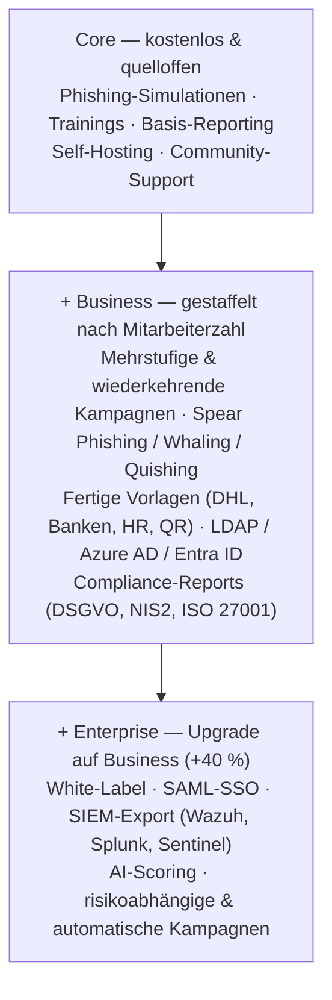

# humanshield.

**Security Awareness, die wirkt — und bei Ihnen bleibt.**

Realistische Phishing-Simulationen, Trainings mit Aha-Effekt und Reporting, das Fortschritt sichtbar macht. Als einzige Lösung am Markt vollständig **self-hosted** betreibbar.

[Preise ansehen](https://humanshield-awareness.de/de/preise) · [Auf GitHub ansehen](https://github.com/HumanShield-Awareness/HumanShield.APP) · [English version](README.en.md)

---

## Das Alleinstellungsmerkmal: Self-Hosting

> **HumanShield ist die einzige Lösung im Vergleich, die sich vollständig selbst hosten lässt.**

Die etablierten Anbieter für Security-Awareness-Training betreiben ihre Plattformen ausschließlich als Cloud-SaaS:

| Anbieter | Deployment |
|---|---|
| KnowBe4 | Cloud-only (gehostet auf AWS) |
| SoSafe | Cloud-only |
| Hoxhunt | Cloud-only |
| Proofpoint | Cloud-only |
| **HumanShield** | **Self-Hosted** |

Damit ist HumanShield für Organisationen relevant, bei denen Cloud-SaaS aus regulatorischen oder vertraglichen Gründen ausscheidet oder nur eingeschränkt infrage kommt — etwa KRITIS-Betreiber, öffentliche Auftraggeber mit BSI-IT-Grundschutz-Vorgaben, Finanzinstitute unter BAIT/VAIT oder Organisationen mit Schrems-II-Bedenken bei der Datenverarbeitung außerhalb der EU. Der Core ist zudem quelloffen: Code prüfen, selbst hosten, volle Kontrolle über die eigene Infrastruktur — ohne Vendor-Lock-in.

---

## Die Plattform

Vom ersten simulierten Angriff bis zum messbaren Kulturwandel — ohne Ballast, ohne Overhead.

| | |
|---|---|
| **🎣 Phishing-Simulationen** | Realistische, anpassbare Kampagnen zeigen Mitarbeitenden, wie aktuelle Angriffe wirklich aussehen — ohne echtes Risiko |
| **🎓 Trainings, die hängen bleiben** | Kurze, interaktive Lerneinheiten statt stundenlanger Pflichtvideos — direkt in den Arbeitsalltag integrierbar |
| **📊 Reporting & Metriken** | Klickraten, Meldequoten und Lernfortschritt auf einen Blick |
| **🔒 Datenschutz zuerst** | DSGVO-konform, datensparsam und auf Wunsch komplett selbst gehostet |
| **🧩 Open Core** | Der Kern ist Open Source — Code prüfen, selbst hosten oder direkt mit Business starten |
| **🔑 Signierte Lizenzen** | Lizenzen sind signiert und werden gegen unseren Lizenzserver geprüft — fälschungssicher und stets aktuell |

---

## So funktioniert's

**01 · Kampagne aufsetzen** — Vorlagen für Phishing-Simulationen und Trainings auswählen, in wenigen Minuten startklar
**02 · Team trainieren** — Mitarbeitende erleben realistische Angriffe, lernen aus Fehlern und melden verdächtige Mails souverän
**03 · Fortschritt messen** — Dashboards zeigen, wie Klickraten sinken und Meldequoten steigen

---

## Funktionsumfang

Die kostenlose **Core**-Version enthält alle Grundfunktionen für den Einstieg. **Business** und **Enterprise** schalten als Jahresabo zusätzliche Funktionen frei.

[Alle Funktionen im Detail →](https://humanshield-awareness.de/de/funktionen)

---

## Warum HumanShield

| | |
|---|---|
| **🇩🇪 Made in Germany** | Vollständig in Deutschland entwickelt und vertrieben — Support auf Deutsch, kurze Wege zu den Entwicklern |
| **🛡️ DSGVO-konform** | Datensparsam by Design, ohne Pflicht zur Datenverarbeitung außerhalb der eigenen Infrastruktur |
| **📜 NIS2-ready** | Unterstützt bei den Schulungs- und Nachweispflichten aus Art. 21 NIS2-Richtlinie |

---

## Repositories

| Repository | Beschreibung |
|---|---|
| [`HumanShield.APP`](https://github.com/HumanShield-Awareness/HumanShield.APP) | Open-Core-Kernanwendung — kostenlos nutzbar und selbst hostbar |
| [`humanshield-awareness.de`](https://github.com/HumanShield-Awareness/humanshield-awareness.de) | Öffentliche Website |

---

## Kontakt

- 🌐 Website: [humanshield-awareness.de](https://humanshield-awareness.de)
- ✉️ Kontakt: [support@humanshield.app](mailto:support@humanshield.app)
- 🏢 HumanShield Awareness UG · Deutschland
- [Impressum](https://humanshield-awareness.de/de/impressum) · [Datenschutz](https://humanshield-awareness.de/de/datenschutz) · [AGB](https://humanshield-awareness.de/de/agb)

